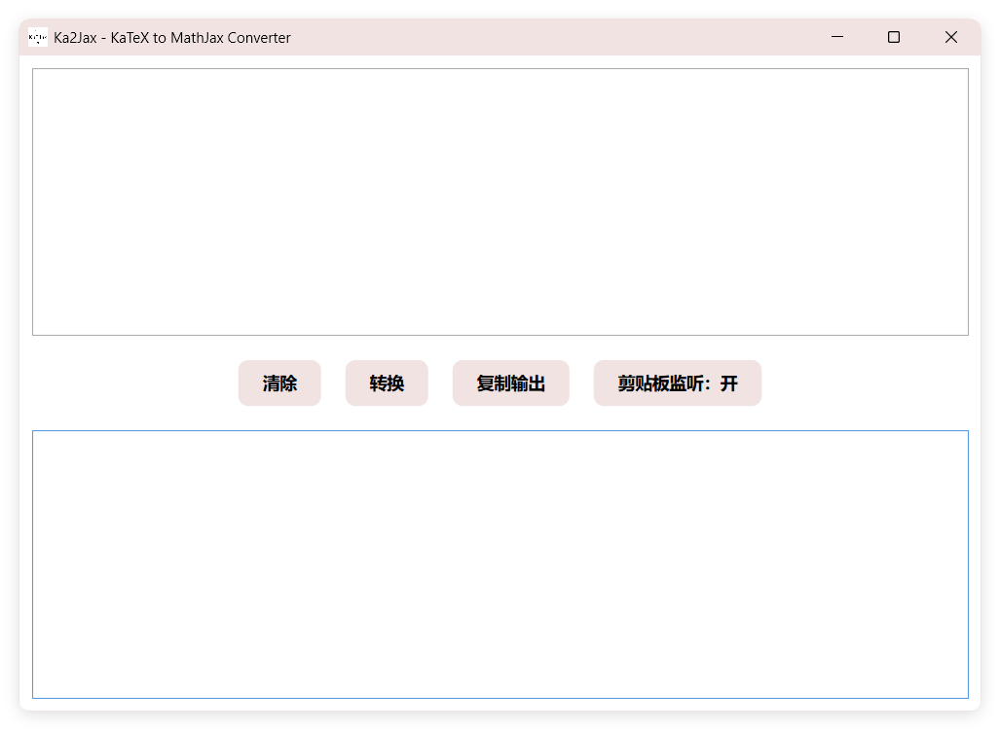

# Ka2Jax

Ka2Jax is a Windows desktop application designed to convert mathematical formulas from KaTeX format to MathJax format. It provides a simple and intuitive interface for users to input KaTeX formulas and get the corresponding MathJax output.

~~There is also a no-gui MacOS app in [Release](https://github.com/Yalyenea/Ka2Jax/releases/).~~

The mac app above might be failed on the latest macos system. There is also a executable file available. Use it by `chmod +x yourpath/Ka2Jax && yourpath/Ka2Jax`, you can also add `alias Ka2Jax='yourpath/Ka2Jax'` in file `~/.zshrc` to replace fullpath, just `Ka2Jax` in Terminal!

### **Key Features:**

1. KaTeX to MathJax Conversion:

   - Converts `\(` and `\)` to `$`
   - Converts `\[` and `\]` to `$$`
   - Handles whitespace around delimiters
2. Clipboard Monitoring:

   - Automatically detects and converts KaTeX formulas copied to the clipboard
   - Updates clipboard with converted MathJax format

### **Screenshot**

### **How to Run:**

1. Ensure .NET 6.0 Runtime is installed on your system
2. Download `.zip` from [Release](https://github.com/Yalyenea/Ka2Jax/releases/)
3. Unzip and run the executable : Ka2Jax.exe
